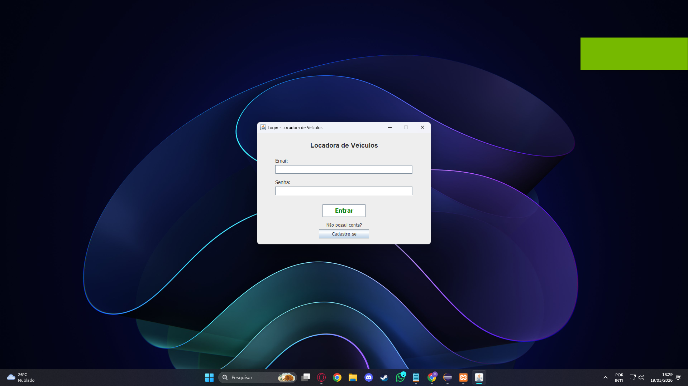
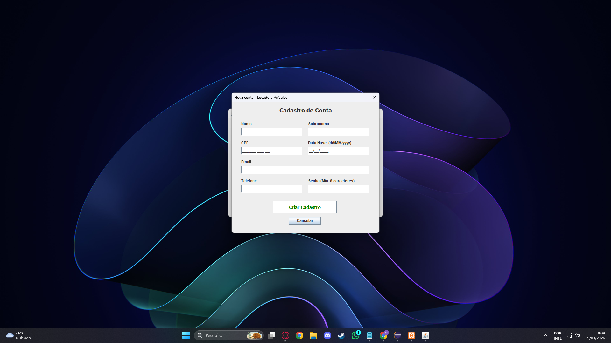
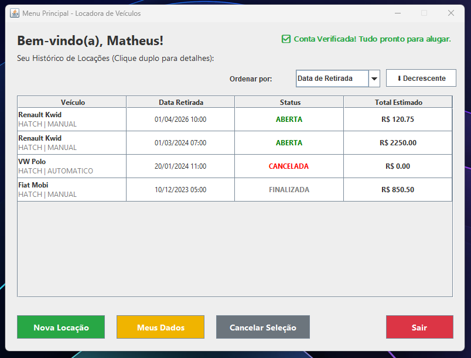
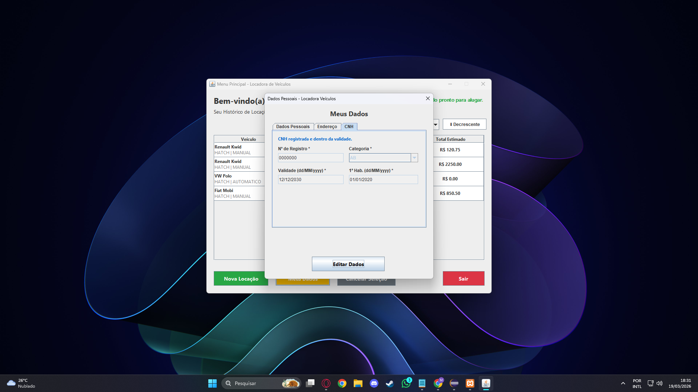
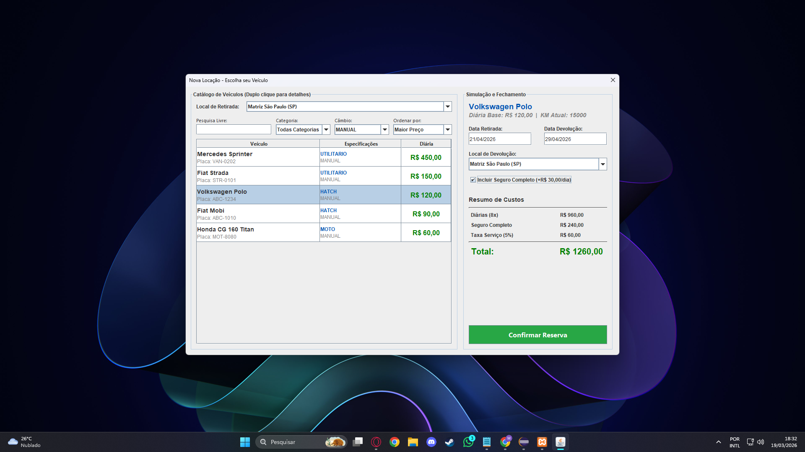
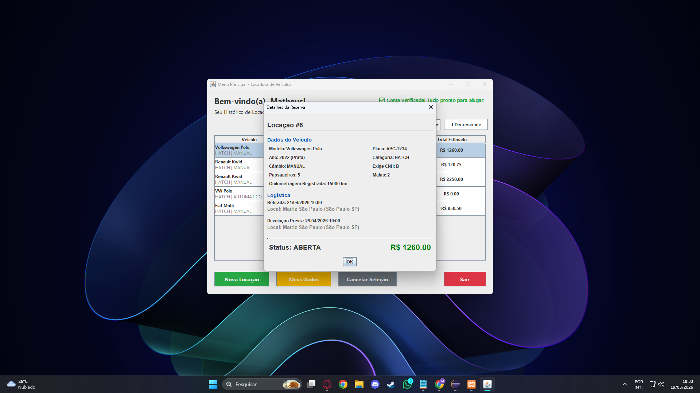

# LocadoraModular-Java

Aplicação desktop em Java (Swing) para gestão básica de uma locadora de veículos, desenvolvida com foco na **arquitetura modular** do sistema.

---

## Objetivo do Projeto

Este projeto teve como objetivo projetar a implementação de uma arquitetura desktop **fortemente modularizada**, aplicando padrões de projeto e boas práticas de engenharia de software em Java.

O foco **não está na complexidade funcional**, mas sim na **organização do código, separação de responsabilidades, testabilidade e facilidade de manutenção**.

---

## Funcionalidades

- Autenticação e gestão de contas de usuários, com validações estruturais e login seguro.
- Gerenciamento de dados cadastrais e verificação de elegibilidade para locação.
- Catálogo de veículos com busca dinâmica, filtros e ordenação.
- Simulação e registro de locações com cálculo automático de valores e taxas.
- Histórico de locações com visualização detalhada e cancelamento de reservas ativas.

As funcionalidades são limitadas apenas ao escopo das ações do cliente propositalmente para manter o foco na arquitetura.

---

## Arquitetura e Decisões de Projeto

O sistema foi estruturado seguindo uma abordagem de **baixo acoplamento**, permitindo que a camada de dados seja substituída (por exemplo, JDBC para REST) com impacto mínimo no restante do código.

- **MVP (Model-View-Presenter)**  
  View passiva, sem lógica de negócio.

- **Arquitetura em Camadas (N-Tier)**  
  VIEW, PRESENTERS, SERVICES, MODELS e DAO.

- **DAO (Data Access Object)**  
  Persistência completamente isolada, permitindo a troca do mecanismo de armazenamento com impacto mínimo.

Essas decisões visam facilitar manutenção, testes unitários e evolução do sistema sem impacto em camadas não relacionadas.

---

## Destaques Técnicos

- Controle manual de transações JDBC para garantir atomicidade em operações críticas.
- Uso de `PreparedStatement` para prevenção de SQL Injection.
- Hash de senhas utilizando SHA-256.
- Validações (Fail-Fast) de dados sensíveis com Regex.
- Exceções de domínio para regras de negócio.

---

## Tecnologias Utilizadas

- **Linguagem:** Java (JDK 17+)
- **Interface Gráfica:** Java Swing
- **Banco de Dados:** MySQL
- **Persistência:** JDBC puro

---

## Como Executar

1. Clone o repositório.
2. Execute o script SQL disponível na pasta `/sql` para criar e popular o banco de dados.
3. Configure as credenciais de acesso ao MySQL na classe de conexão JDBC.
4. Adicione o driver JDBC (`mysql-connector`) ao Build Path na pasta `lib`.
5. Execute a classe principal de login para iniciar a aplicação.

---

## Screenshots

### Tela de Login

### Cadastro de Clientes

### Menu Principal

### Consulta de Dados

### Registro de Locação

### Menu de Locações

---

## Demonstração em Vídeo

Confira o funcionamento do sistema e a explicação detalhada da arquitetura no link abaixo:

[Assistir apresentação do projeto no YouTube](link) 

---
Desenvolvido por **Matheus Van Deursen**.
